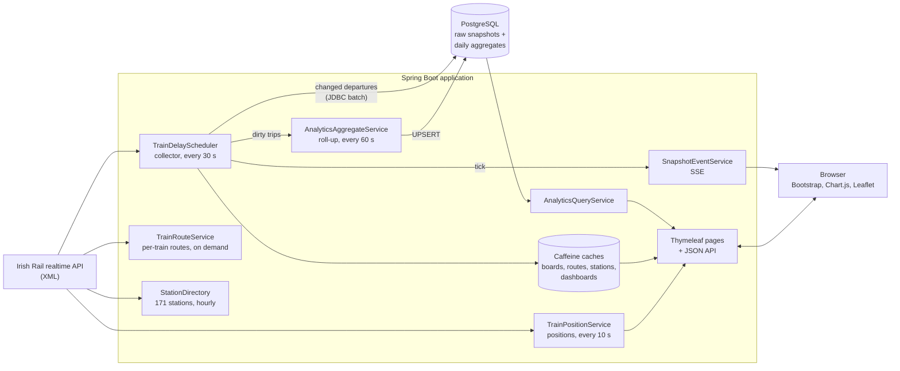

# RailDelayTracker (IERailMetrics)

[](https://github.com/Pablokaer/RailDelayTracker/actions/workflows/build.yml)

**RailDelayTracker** is a real-time monitoring and analytics platform for the Irish Rail network
(Iarnród Éireann). In the browser it is branded **IERailMetrics**.

It polls the public Irish Rail realtime API around the clock, keeps a history of every delay it
observes in PostgreSQL, and turns that history into dashboards: which stations, routes, hours and
destinations run late, how often, and by how much. Alongside the analytics it offers live departure
boards, a station-to-station journey planner and a live map of every train in the country.

The original focus was the **DART** (Dublin Area Rapid Transit) coastal line served from Dublin
Connolly. It now also tracks the **Heuston** side of the network: the InterCity and commuter
services running in and out of Dublin Heuston.

---

## Table of contents

- [What the application does](#what-the-application-does)
- [How it works](#how-it-works)
- [Tech stack](#tech-stack)
- [Getting started](#getting-started)
- [Configuration](#configuration)
- [Pages](#pages)
- [REST API](#rest-api)
- [Database](#database)
- [Data retention](#data-retention)
- [Observability](#observability)
- [Security and hardening](#security-and-hardening)
- [Project structure](#project-structure)
- [Testing and CI](#testing-and-ci)
- [Data source and attribution](#data-source-and-attribution)

---

## What the application does

The application has four views, all reachable from the tab bar and the view selector in the header.

### 1. Overview: network analytics (`/overview`)

The landing page. It answers "how punctual has the network been?" for a chosen period and scope.

- **Scopes:** *General* (everything collected), *Connolly* (DART / Connolly-side services) and
  *Heuston* (services to and from Dublin Heuston). Switching scope reloads the data in place,
  without a full page navigation.
- **Periods:** *Today* (the default), *Yesterday*, *Last 7 days*, *Last 30 days*, *All time*, or a
  custom `from`/`to` date range.
- **Network summary:** total snapshots, unique trips, delayed vs on-time trips, delay rate, average
  and maximum delay.
- **Last captured with delay:** a live feed of the most recent delayed observations (train,
  station, origin, destination, delay).
- **Hourly delay pattern:** delay percentage and average delay for each hour of the day (Chart.js).
- **Top 10 largest delays:** the worst individual trips in the period, with where the peak
  happened.
- **Top destinations by average delay** and **delay severity** breakdown (see
  [delay categories](#delay-categories)).
- **Top routes by average delay:** origin → destination pairs ranked by delay.
- **Station ranking:** every station in scope with trips, delayed/on-time counts, delay rate,
  average and total delay, with podium medals for the worst three.

The page subscribes to a server-sent event stream, so the numbers refresh on their own after every
collection cycle.

### 2. Live station board (`/get?stationCode=XXXX`)

A departure board for a single station, refreshed every 30 seconds with a visible countdown.

- Every train due in the next 90 minutes: train code, type, origin, destination, direction,
  scheduled vs expected arrival/departure, due-in minutes, status, delay and last known location.
- *Northbound* / *Southbound* tabs and an *All* / *Delayed only* filter.
- Live counters: total trains, on time, delayed.
- Below the board, system-wide analytics for the selected period: on-time vs delayed chart, delay
  probability, hourly pattern, destinations, delay categories, the 15 worst stations and the top 10
  delays.

### 3. Journey planner (`/journey`)

Pick a *from* and a *to* station (with search-as-you-type pickers) and the planner lists every
live service that calls at both, in the right order. For each option it shows departure from the
origin, arrival at the destination, the train's final destination, due-in time, status and current
delay.

It works by reading the live boards of both stations and joining them on *train code + train date*,
keeping only trains that reach the destination after they leave the origin.

### 4. Live train map (`/map`)

A Leaflet map of Ireland showing every train currently in the system.

- Each train is a marker **coloured by its delay category** and **rotated to its heading**. Markers
  animate smoothly between position updates (every 10 seconds).
- Filters: *Running* vs *All trains* (including not-yet-running and terminated), *Delayed only*, and
  a text search.
- Optional layers: all stations, and the physical rail network from OpenRailwayMap.
- Clicking a train opens a side drawer with two tabs:
  - **Route:** the full stop-by-stop path drawn on the map, with the part already travelled
    highlighted and the scheduled / expected / actual time and delay at every stop.
  - **History:** the delay history recorded in the database for that train code, which links
    the live map back to the analytics.

### Delay categories

Every observation is classified into one band. The bands live in a single enum
(`DelayCategory`), which drives the UI colours and legend **and** generates the SQL used to build
the aggregates, so the two cannot disagree.

| Category | Minutes late | Colour |
|---|---|---|
| On Time | 0–4 | green |
| Small Delay | 5–9 | blue |
| Medium Delay | 10–19 | amber |
| Big Delay | 20–39 | orange |
| Extreme Delay | 40+ | red |

A trip counts as **delayed** at 5 minutes or more (`DelayLimits.DELAYED_THRESHOLD_MINUTES`).

---

## How it works



### Data sources

All data comes from the public Irish Rail realtime API at
`https://api.irishrail.ie/realtime/realtime.asmx`. It returns XML, which is deserialised with
Jackson XML.

| Endpoint | Used for |
|---|---|
| `getAllStationsXML_WithStationType?StationType=D` | DART stations (Connolly collection scope) |
| `getAllStationsXML_WithStationType?StationType=M` / `S` | Mainline and suburban stations (Heuston collection scope) |
| `getAllStationsXML_WithStationType?StationType=A` | All 171 stations: name/code resolution, coordinates, input validation |
| `getStationDataByCodeXML_WithNumMins?NumMins=90&StationCode=…` | Departure board: trains due at a station in the next 90 minutes |
| `getCurrentTrainsXML` | Live position, status and public message of every train |
| `getTrainMovementsXML?TrainId=…&TrainDate=…` | Stop-by-stop movements of one train (map route drawer) |

### The collector

`TrainDelayScheduler` is the core of the application. During operating hours (06:00–00:30,
server local time) it runs every 30 seconds (`fixedDelay`, so a slow cycle never overlaps the
next) and:

1. **Builds the station list** for both scopes: DART stations for *Connolly*, mainline and
   suburban stations for *Heuston*. Lists are de-duplicated to one entry per physical station
   (the four-track Kildare line publishes each station three times).
2. **Fetches every departure board concurrently** (~130–140 stations) on a deliberately small,
   bounded thread pool (`irishrail.collector.threads`, 8 by default) matched to the HTTP
   connection pool. That keeps the load on the upstream API polite and predictable. A cycle has a
   time budget; stations that miss it are skipped, not waited for.
3. **Filters** the boards: bus replacement services are dropped; the Connolly scope excludes trains
   running to or from Heuston; outside Heuston itself, the Heuston scope keeps only Heuston-related
   trains.
4. **Detects changes.** An in-memory map remembers the last delay seen for each
   *(scope, train, station, date, scheduled departure)*. Only departures whose delay actually
   changed are written, which keeps the raw table about an order of magnitude smaller.
5. **Persists** the changes as one JDBC batch per scope (a few milliseconds per cycle).
6. **Marks the touched trips as dirty** for the aggregate roll-up, and **broadcasts an SSE tick**
   so open dashboards refresh.

Boards fetched by the collector are cached (`irishrail.api.board-cache-ms`) and reused by the live
board and the journey planner, so any number of open browser tabs costs no extra upstream calls.

### Analytics: raw snapshots → daily aggregates

Raw observations (`trip_station_snapshot`) are expensive: ~120k rows and ~33 MB a day. Every
date-ranged dashboard therefore reads from three **daily aggregate tables** instead, which cost
about 75× less per day of history:

- `AnalyticsAggregateService.flushDirty()` runs every 60 s and re-aggregates **only the trips
  the collector changed** since the last run, never the whole day.
- On startup it backfills any day that has raw data, so the aggregates are always complete.
- All writes are idempotent UPSERTs, serialised by a PostgreSQL transaction-scoped
  **advisory lock**, so the startup backfill and the periodic roll-up never deadlock, even with
  several instances running.
- `AnalyticsQueryService` assembles one complete dashboard (`AnalyticsView`) per
  *(period, scope)* and caches it for 10 s. The server-rendered page and its JSON refresh read the
  same object, so they can never show different numbers.

Because the aggregates are durable and kept independently of the raw data, "All time" charts keep
working long after the raw snapshots have been deleted.

### Live positions and heading

`TrainPositionService` refreshes `getCurrentTrainsXML` on a timer (every 10 s) into an immutable
in-memory snapshot. `/api/train-positions` only ever reads that snapshot, so the upstream call rate
is fixed no matter how many people have the map open.

The `PublicMessage` field packs three lines separated by a **literal** `\n` (two characters, not a
line break):

```
A220\n16:00 - Dublin Heuston to Cork (2 mins late)\nDeparted Inchicore next stop Thurles
```

`PublicMessageParser` extracts train code, origin, destination, scheduled/expected departure,
minutes late (negative when early), last location and next stop. This is the only place the map
gets delay information from, so it is covered by unit tests.

To decide which way a marker points, the service tries these sources in order of reliability and
reports which one it used:

1. **movement:** bearing between the previous and current position (needs ≥ 60 m of travel; kept
   for up to 3 minutes because upstream only refreshes coordinates about once a minute);
2. **next-stop:** bearing to the next scheduled stop;
3. **destination:** bearing to the final destination;
4. **compass:** the `Direction` field, when it holds a compass word;
5. **previous:** the last known heading.

When none apply, the heading is `null` and the map draws a plain dot rather than an arrow pointing
at a guess.

Station names in the feed are resolved against `StationDirectory`, an exact, accent- and
punctuation-insensitive index over all 171 stations (for example, "Connolly" matches "Dublin
Connolly", but "Ennis" never matches "Enniscorthy").

### Real-time updates in the browser

- **Server-Sent Events** (`/api/events`): the collector broadcasts a payload-less `snapshot` tick
  after each cycle; dashboards re-fetch their JSON when they receive it. A 25 s heartbeat keeps
  connections alive through proxies, and broadcasts run on their own worker so a slow client never
  delays data collection.
- **Visibility-aware polling** (`app.js`): the live board and the map poll on an interval, pause
  while the tab is hidden, and back off exponentially when the server fails.

### Caching summary

| Cache | Lifetime | Purpose |
|---|---|---|
| Station lists | 1 h (stale copy served if the API is down) | Station pickers, collection lists |
| Station directory | 1 h | Name/code → station, coordinates |
| Departure boards | 35 s (one collection cycle) | Live board, journey planner |
| Train routes | 30 s | Map route drawer |
| Train positions | refreshed every 10 s | Map |
| Analytics dashboards | 10 s | Overview, live board analytics |

All caches are bounded [Caffeine](https://github.com/ben-manes/caffeine) caches, so no request
parameter can grow memory without limit.

---

## Tech stack

### Backend

| Technology | Role |
|---|---|
| **Java 21** | Language. Virtual threads serve HTTP requests (`spring.threads.virtual.enabled`); records are used for DTOs and configuration. |
| **Spring Boot 3.5** | Application framework, auto-configuration, packaging as a single executable JAR. |
| **Spring Web MVC** | Page controllers, JSON REST API, `SseEmitter` for server-sent events. |
| **Spring `RestClient` + Apache HttpClient 5** | Pooled HTTP client for the Irish Rail API with mandatory connect/read timeouts. |
| **Jackson XML** (`jackson-dataformat-xml`) | Deserialises the API's XML responses into Java models. |
| **Spring Scheduling** (`@Scheduled`) | Collector, position refresher, station directory, aggregate roll-up, retention sweep, SSE heartbeat. |
| **Spring Validation** | Validates every `irishrail.*` property at boot; bad configuration fails fast. |
| **Caffeine** | Bounded, self-evicting in-memory caches; also backs the per-client rate limiter. |

### Persistence

| Technology | Role |
|---|---|
| **PostgreSQL** | Primary data store. The analytics SQL is PostgreSQL-specific: `DISTINCT ON`, `ON CONFLICT` UPSERTs, BRIN and partial indexes, advisory locks. |
| **Spring Data JPA / Hibernate** | Entities and repositories for trips and snapshots. Hibernate runs with `ddl-auto=validate`. |
| **Spring `NamedParameterJdbcTemplate`** | Hand-written aggregate roll-up and analytics queries, and batched snapshot inserts. |
| **Flyway** | Owns the schema. All DDL lives in versioned migrations under `src/main/resources/db/migration`. |

### Frontend

The UI is server-rendered and progressively enhanced, with no JavaScript build step.

| Technology | Role |
|---|---|
| **Thymeleaf** | Server-side HTML templates with a shared layout fragment. |
| **Bootstrap 5.3** + **Bootstrap Icons** | Layout, components and icons. |
| **Chart.js 4** | Hourly, destination, category and on-time charts. |
| **Leaflet 1.9** | Live train map. |
| **Esri World Light Gray Canvas** | Keyless base map tiles (configurable). |
| **OpenRailwayMap** | Optional overlay of the physical rail network. |
| **Vanilla JavaScript** | Page logic in `src/main/resources/static/js` (`overview.js`, `trains.js`, `journey.js`, `map.js`, shared `app.js`). |

Third-party assets are loaded from jsDelivr with Subresource Integrity (SRI) hashes. Pages include
a Google Analytics tag.

### Operations and quality

| Technology | Role |
|---|---|
| **Spring Boot Actuator** | Health, liveness/readiness probes, info. |
| **Micrometer + Prometheus** | Application and custom metrics at `/actuator/prometheus`. |
| **Maven** | Build. Surefire runs unit tests, Failsafe runs integration tests. |
| **JUnit 5, Mockito, Spring Boot Test** | Unit and web-slice tests. |
| **Testcontainers (PostgreSQL)** | Integration tests against a real, throwaway PostgreSQL. |
| **GitHub Actions** | CI: `mvn verify` on every push and pull request. |

---

## Getting started

### Prerequisites

- **Java 21+**
- **Maven 3.8+**
- **PostgreSQL** (any recent version) reachable on `localhost:5432`
- *(optional)* **Docker**, to run the integration tests

### 1. Create the database

```sql
CREATE DATABASE irishrail;
```

An empty database is enough. **Flyway creates the schema on first start**, and Hibernate then
refuses to boot if the entities and the migrated schema ever disagree.

Databases created by older versions of the app (which used `ddl-auto=update`) are picked up as-is:
`baseline-on-migrate` records them at version 0, and the migrations, all written as
`CREATE ... IF NOT EXISTS`, apply as a no-op.

### 2. Run in development

```bash
git clone https://github.com/Pablokaer/RailDelayTracker.git
cd RailDelayTracker
mvn spring-boot:run
```

Open <http://localhost:8080>. Credentials default to `postgres` / `postgres`; override them with
`DB_USERNAME` and `DB_PASSWORD`.

Data collection starts immediately during operating hours (06:00–00:30). The dashboards fill up
as the collector records delays; the live board, journey planner and map work straight away.

### 3. Build and run for production

```bash
mvn clean package
DB_USERNAME=irishrail DB_PASSWORD=secret \
SPRING_DATASOURCE_URL=jdbc:postgresql://db-host:5432/irishrail \
java -jar target/irishrail-0.0.1-SNAPSHOT.jar --spring.profiles.active=prod
```

The `prod` profile (`application-prod.properties`):

- **requires** `DB_PASSWORD` (no default);
- enables the Thymeleaf template cache;
- trusts `X-Forwarded-*` headers (`server.forward-headers-strategy=framework`) for running behind
  a reverse proxy;
- enables gzip compression for HTML, CSS, JS and JSON.

Run a **single instance** of the collector per database. The aggregate writes are safe under
concurrency, but each instance would poll the upstream API on its own.

---

## Configuration

Settings live in `src/main/resources/application.properties`. Any of them can be overridden with
an environment variable (`IRISHRAIL_COLLECTOR_THREADS=4`) or a command-line argument
(`--irishrail.collector.threads=4`).

Every `irishrail.*` key is bound to the validated record tree in
`config/IrishRailProperties.java`: a misspelled key or an out-of-range value fails the boot
instead of silently falling back to a default.

### Environment variables

| Variable | Default | Description |
|---|---|---|
| `DB_USERNAME` | `postgres` | Database user |
| `DB_PASSWORD` | `postgres` (required in `prod`) | Database password |
| `SPRING_DATASOURCE_URL` | `jdbc:postgresql://localhost:5432/irishrail` | JDBC URL |
| `SPRING_PROFILES_ACTIVE` | none | Set to `prod` in production |

### Main properties

| Property | Default | Description |
|---|---|---|
| **Collector** | | |
| `irishrail.collector.interval-ms` | `30000` | Delay between collection cycles |
| `irishrail.collector.threads` | `8` | Concurrent station fetches (keep it small; it protects the upstream API) |
| `irishrail.collector.queue-capacity` | `512` | Fetch queue size |
| `irishrail.collector.cycle-budget-seconds` | `120` | Max time a cycle waits for slow stations |
| `irishrail.connolly.collection-station-types` | `D` | Station types collected for the Connolly scope |
| `irishrail.heuston.collection-station-types` | `M,S` | Station types collected for the Heuston scope |
| `irishrail.tracked-station-codes` | `CNLLY,HSTON` | Stations offered as service tabs |
| **Upstream API** | | |
| `irishrail.api.*-url` | Irish Rail endpoints | See [data sources](#data-sources) |
| `irishrail.api.connect-timeout-ms` / `read-timeout-ms` | `4000` / `8000` | Mandatory HTTP timeouts |
| `irishrail.api.station-cache-ms` | `3600000` | Station list / directory cache |
| `irishrail.api.board-cache-ms` | `35000` | Departure board cache |
| `irishrail.api.route-cache-ms` | `30000` | Train route cache |
| `irishrail.api.max-cached-boards` / `max-cached-routes` | `400` / `400` | Cache size bounds |
| `irishrail.api.train-positions-refresh-ms` | `10000` | Live position refresh interval |
| **Analytics** | | |
| `irishrail.analytics.aggregates.refresh-ms` | `60000` | Aggregate roll-up interval |
| `irishrail.analytics.aggregates.backfill-on-startup` | `true` | Rebuild aggregates for days with raw data at boot |
| `irishrail.analytics.overview-cache-ms` | `10000` | Dashboard cache lifetime |
| `irishrail.analytics.overview-cache-max-entries` | `200` | Dashboard cache size |
| **Retention** | | |
| `irishrail.retention.days` | `30` | Days of raw snapshots kept |
| `irishrail.retention.aggregate-days` | `0` | Days of aggregates kept (`0` = forever) |
| `irishrail.retention.startup-delay-ms` | `45000` | Delay before the post-boot retention sweep |
| **Web** | | |
| `irishrail.sse.heartbeat-ms` | `25000` | SSE keep-alive interval |
| `irishrail.sse.max-clients` | `500` | Max concurrent SSE subscribers (then `503`) |
| `irishrail.rate-limit.enabled` | `true` | Per-IP throttle on `/api/**` |
| `irishrail.rate-limit.requests-per-minute` / `burst` | `120` / `60` | Token bucket size |
| **Map** | | |
| `irishrail.map.tile-url` / `tile-attribution` / `tile-max-zoom` | Esri Light Gray, zoom 16 | Base map |
| `irishrail.map.tile-filter` | `brightness(0.68) contrast(1.06) saturate(0.9)` | CSS filter on tiles (`none` to disable) |
| `irishrail.map.rail-overlay-url` / `rail-overlay-attribution` | OpenRailwayMap | Rail network overlay |
| `irishrail.map.refresh-ms` | `10000` | Map polling interval in the browser |

> **Map tiles.** `tile.openstreetmap.org` may not be used for production traffic under the OSMF
> tile usage policy, and CARTO basemaps require an API key since August 2026 (without one they
> return a placeholder image). Esri's World Light Gray Canvas is keyless. Note its `{z}/{y}/{x}`
> order. To use another provider, swap the URL; no code change is needed.

---

## Pages

| Route | Description |
|---|---|
| `/` | Redirects to `/overview` |
| `/overview` | Network analytics, all scopes, today by default |
| `/overview?stationCode=CNLLY` | Connolly scope only |
| `/overview?stationCode=HSTON` | Heuston scope only |
| `/overview?period=all` | All-time analytics |
| `/overview?from=YYYY-MM-DD&to=YYYY-MM-DD` | Custom date range |
| `/get?stationCode=XXXX` | Live departure board for a station, plus analytics (`from`/`to` supported) |
| `/journey` | Station-to-station journey planner |
| `/map` | Live train map |

---

## REST API

All JSON endpoints live under `/api` and are rate limited per client IP.

| Endpoint | Description |
|---|---|
| `GET /api/trains?stationCode=XXXX` | Live departure board for a station |
| `GET /api/stations` | Tracked service stations (Connolly, Heuston) |
| `GET /api/stations/all` | Every station with coordinates (map layer) |
| `GET /api/journey-options?fromStationCode=X&toStationCode=Y` | Live services calling at both stations, in order |
| `GET /api/train-positions` | Live positions with heading, heading source, status, delay and next stop |
| `GET /api/trains/{trainCode}/route?trainDate=dd MMM yyyy` | Stop-by-stop route of one train, with progress and per-stop delay |
| `GET /api/trains/{trainCode}/history?limit=25` | Recorded delay history for a train code (max 100 rows) |
| `GET /api/analytics/overview?from&to&stationCode&period` | Full dashboard payload (`AnalyticsView`) |
| `GET /api/analytics/summary?from&to` | Dashboard payload for all scopes |
| `GET /api/analytics/trains` | Top 10 most delayed trains |
| `GET /api/analytics/recent` | Recent delay snapshots |
| `GET /api/analytics/daily` | Delayed trips per day |
| `GET /api/events` | Server-Sent Events stream (`connected`, `snapshot` ticks, keep-alive comments) |

Operational endpoints:

| Endpoint | Description |
|---|---|
| `GET /actuator/health` | Health, with `/liveness` and `/readiness` probe groups |
| `GET /actuator/info` | Application info |
| `GET /actuator/metrics` | Metric browser |
| `GET /actuator/prometheus` | Prometheus scrape endpoint |

**Input handling.** Station codes are checked against the station directory before they reach a
cache key or an upstream URL, and `from`/`to` are parsed as ISO dates. Invalid input returns
`400` with an [RFC 7807](https://www.rfc-editor.org/rfc/rfc7807) problem body. Requests over the
rate limit get `429` with a `Retry-After` header. When the SSE subscriber cap is reached,
`/api/events` returns `503`.

---

## Database

### Tables

| Table | Grain | Description |
|---|---|---|
| `trip` | journey | Each unique journey (`train_code` + `train_date`), with origin and destination |
| `trip_station_snapshot` | observation | Each observed change of a train's delay at a station, with its service scope. The only fast-growing table |
| `daily_trip_metrics` | date × scope × trip | Each trip's peak delay and where it happened. Feeds the summary, delay categories, destinations, routes, top 10 and daily delays |
| `daily_station_route_metrics` | date × scope × station × route | Feeds the station ranking |
| `daily_hourly_metrics` | date × scope × hour | Feeds the hourly delay pattern |

The three `daily_*` tables are written with UPSERTs, so re-running a date is idempotent. They are
**durable**: nothing drops or truncates them, which is what lets raw snapshots be deleted without
losing history. Changing their shape needs a new Flyway migration.

### Migrations

| File | Contents |
|---|---|
| `V1__baseline_core_tables.sql` | `trip`, `trip_station_snapshot`, keys and foreign key |
| `V2__analytics_aggregate_tables.sql` | The three `daily_*` tables and their indexes |
| `V3__query_performance_indexes.sql` | BRIN, partial and expression indexes; autovacuum tuning |

The 5-minute delayed threshold is baked into a partial index in `V3`, and a migration cannot read
a Java constant. `DelayCategorySqlTest` fails the build if
`DelayLimits.DELAYED_THRESHOLD_MINUTES` is changed without a new migration to rebuild that index.

---

## Data retention

Measured on a live database:

| | Per day | 30 days | 1 year |
|---|---|---|---|
| `trip_station_snapshot` (~120k rows/day, ~278 B each) | ~33 MB | ~1.0 GB | ~12 GB |
| The three `daily_*` aggregates | ~440 kB | ~13 MB | ~160 MB |

Because aggregates are ~75× cheaper, raw data and aggregates are trimmed on **separate** cutoffs:

```properties
irishrail.retention.days=30                 # raw snapshots
irishrail.retention.aggregate-days=0        # 0 = keep aggregate history forever
irishrail.retention.startup-delay-ms=45000  # the sweep also runs once after each boot
```

The sweep runs every day at 03:00 **and** once shortly after startup, so retention still applies
to instances that are not running at 03:00. Raw snapshots are deleted on whole-day boundaries, and
orphaned trips are removed with them.

Thirty days of raw data covers every date filter the UI offers and keeps the drill-down features
(recent delays, per-train history) populated. Everything date-ranged reads the aggregates, so
"All time" keeps working far beyond the raw window.

> **`DELETE` does not shrink PostgreSQL data files.** It frees space for reuse by later inserts.
> Lowering the retention stops growth but does not return disk to the operating system. To do
> that, run `scripts/maintenance/reclaim-space.sql` once. It also drops two orphaned legacy tables
> and tunes autovacuum. Read it first: it takes exclusive locks.

---

## Observability

Besides the standard JVM, HTTP and datasource metrics, the application publishes:

| Metric | Type | Meaning |
|---|---|---|
| `irishrail.upstream` | timer | Irish Rail API calls, tagged by `endpoint` and `outcome` |
| `irishrail.collector.cycle` | timer | Duration of each collection cycle |
| `irishrail.collector.snapshots.saved` | counter | Snapshots written |
| `irishrail.collector.state.entries` | gauge | Size of the change-detection map |
| `irishrail.positions.tracked` | gauge | Trains whose last position is tracked for heading |
| `irishrail.sse.subscribers` | gauge | Open SSE connections |
| `irishrail.ratelimit.rejected` | counter | Requests rejected by the rate limiter |

The collector logs a one-line summary of every cycle that saved data (snapshots saved, stations
checked, fetch and persist time).

---

## Security and hardening

- **Security headers** on every response (`SecurityHeadersFilter`): Content-Security-Policy,
  `X-Content-Type-Options: nosniff`, `Referrer-Policy`, `X-Frame-Options: DENY` and a restrictive
  `Permissions-Policy`.
- **Subresource Integrity** on all CDN scripts and stylesheets.
- **Rate limiting:** a per-IP token bucket on `/api/**` (`RateLimitFilter`). It is per instance,
  which protects the process from a single noisy client.
- **Validation at the edge:** station codes, dates and limits are validated before they touch
  caches, SQL or upstream URLs; upstream URLs are built with proper encoding.
- **Bounded resources:** every cache, thread pool and the SSE subscriber list has a hard limit,
  and every upstream call has a timeout.
- **Graceful degradation:** when the Irish Rail API fails, the app serves the last good station
  list, a recent board (up to two cycles old) or the last known train positions instead of an
  empty page.

The application has no authentication: all pages are intentionally public and read-only.

---

## Project structure

```
.github/workflows/build.yml          # CI: mvn verify on every push / PR
scripts/maintenance/
  reclaim-space.sql                  # One-off disk reclaim after lowering retention

src/main/java/com/irishrail/
  IrishRailApplication.java
  config/
    IrishRailProperties.java         # Every irishrail.* setting, validated, one record tree
    RestClientConfig.java            # Pooled HTTP client with mandatory timeouts + shared XmlMapper
    CollectorConfig.java             # Bounded station-fetch pool; single SSE broadcast worker
    SchedulingConfig.java            # @EnableScheduling, switchable so tests can load a context
  controller/
    PageController.java              # Server-rendered pages
    ApiController.java               # JSON + SSE endpoints
  web/
    StationCodes.java                # Station code validation at the edge
    ApiExceptionHandler.java         # RFC 7807 problem responses for the API
    InvalidRequestException.java
    SecurityHeadersFilter.java       # CSP, nosniff, referrer policy, frame options
    RateLimitFilter.java             # Per-client token bucket on /api/**
  model/
    Station, StationList, StationPoint          # Station feed + map layer
    TrainInfo, TrainInfoList                    # Departure board feed
    TrainPosition, TrainPositionList, LiveTrain # Position feed + what the map consumes
    TrainMovement, TrainMovementList, TrainRoute# Movements feed + route drawer payload
    Trip, TripStationSnapshot                   # JPA entities
    AnalyticsView, DashboardSummary, ...        # Analytics payloads
    DelayCategory, DelayLimits                  # Delay bands; also generate aggregate SQL
    ServiceScope                                # CONNOLLY / HEUSTON
  repository/
    TripRepository.java
    TripStationSnapshotRepository.java
  service/
    IrishRailService.java            # Irish Rail API client; station + board caches
    StationDirectory.java            # Name/code → station index over all 171 stations
    TrainDelayScheduler.java         # The collector + retention sweep
    DelayTrackingService.java        # Batched persistence and analytics queries
    AnalyticsAggregateService.java   # Daily roll-ups, backfill, advisory lock
    AnalyticsQueryService.java       # Builds + caches one dashboard for page and API
    TrainPositionService.java        # Live positions, heading resolution
    TrainRouteService.java           # Stop-by-stop routes from getTrainMovementsXML
    SnapshotEventService.java        # Server-Sent Events
  util/
    PublicMessageParser.java         # Parses the three-line PublicMessage field
    GeoUtils.java                    # Bearing, distance, compass words

src/main/resources/
  application.properties             # Defaults (development)
  application-prod.properties        # Production overrides
  db/migration/                      # Flyway migrations: the only place DDL lives
  static/
    css/app.css                      # Shared design tokens + page chrome
    js/app.js                        # escapeHtml, view switching, visibility-aware polling
    js/overview.js | trains.js | journey.js | map.js
  templates/
    fragments/layout.html            # <head> assets (with SRI), analytics tag, site header
    overview.html | trains.html | journey.html | map.html

src/test/java/com/irishrail/
  **/*Test.java                      # Unit + web-slice tests, no database (Surefire)
  **/*IT.java                        # PostgreSQL integration tests (Failsafe)
  support/PostgresIntegrationTest.java
```

---

## Testing and CI

```bash
mvn test      # unit and web-slice tests; no database needed
mvn verify    # the above plus the PostgreSQL integration tests
```

Unit tests cover the public message parser, geo maths, station de-duplication and directory
lookups, station code validation, the rate limiter, the live train model, the API controller and
the delay-category SQL guard.

The integration tests need a real PostgreSQL, because the analytics layer is not portable SQL.
They start one with **Testcontainers** when Docker is available and **skip themselves when it is
not**, so `mvn verify` passes anywhere. Without Docker, point them at an existing server instead.
The named database is written to and truncated, so do not use one you care about:

```bash
mvn verify -Dirishrail.test.datasource.url=jdbc:postgresql://localhost:5432/irishrail_test
```

The integration suite checks that:

- the Flyway migrations build a working schema from nothing, and Hibernate's `validate` agrees
  with it (the only check that migrations and `@Entity` classes still describe the same tables);
- the **incremental** roll-up the collector triggers produces the same aggregates as the full
  backfill;
- aggregate history survives the deletion of the raw snapshots it was derived from.

**CI:** `.github/workflows/build.yml` runs `mvn verify` on JDK 21 (Temurin) for every push and pull
request. The GitHub runner has Docker, so the integration tests run against a real PostgreSQL.
Test reports are uploaded as build artifacts.

**CD:** `.github/workflows/deploy.yml` deploys every commit that passes the build on `main` to the VPS: it
packages the jar on the runner and streams it over a restricted SSH key to `deploy/deploy.sh`, which swaps the
release, restarts the systemd service and rolls back if the health check fails. Setup and rollback:
[docs/deploy.md](docs/deploy.md).

---

## Data source and attribution

- Train and station data: [Irish Rail realtime API](https://api.irishrail.ie/realtime/)
  (Iarnród Éireann). This project is independent and is **not affiliated with or endorsed by
  Irish Rail**. Delay figures are derived from the public feed and may differ from official
  punctuality statistics.
- Base map tiles: © Esri, HERE, Garmin, © OpenStreetMap contributors.
- Rail network overlay: © [OpenRailwayMap](https://www.openrailwaymap.org/) (volunteer-run; please
  keep traffic reasonable).
